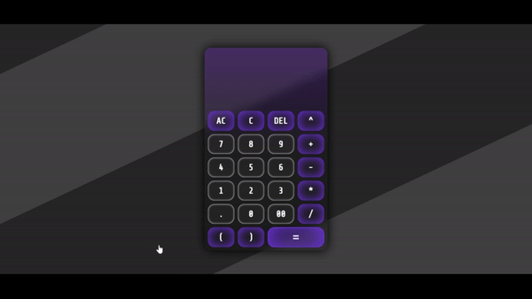
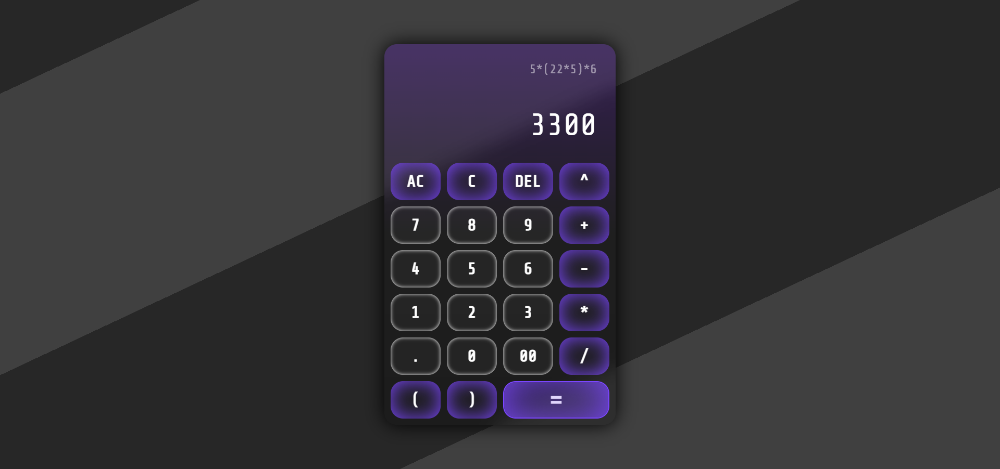

# Basic Calculator :pager:




This project emulates a simple calculator with most of the required functionalities, using only `HTML`, `CSS` and `Javascript`. 

## Features:nerd_face:
- Simple algebraic calculations
- automatically add multiplication symbols whenever necessary
- restrict user from typing wrong expressions
- **Responsive**
- Created **glassmorphism** effect
- **dark theme** UI
- Simple **hover** and **click effects**

## How to Use :clipboard:
- Open cmd and type in the following command:
```
git clone https://github.com/Soumyajit0803/Basic-calculator.git
```
Hit enter and wait for git to clone the repo in your local machine. 
- Then enter the folder `Basic-calculator` and open `calculator.html`.
- There you go!

## License :page_with_curl:
[MIT License](./LICENSE)


